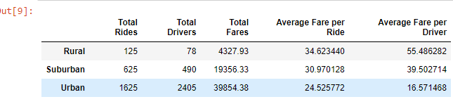

# PyBer_Analysis
# Overview of Project
## Purpose
Using our Python skills and knowledge of Pandas, we will create a summary of Data Frame of the ride-sharing data by city type. After that, using Pandas and Matplotlib, we will create a multiple-line graphs that shows total fares for each city type. And a final analysis of report of how the data differs by city type, and how that difference helps the decision makers.
# Results
   ###Summary data Frame 
   

## According to summary data frame, Average fare per driver decreased with increase in total fares and total number of drivers, which significantly lower compared to Rural and Suburban. Whereas the Average Fare per ride is high in Rural with increased with high total fares and less total rides compared to Suburban and Urban.

## And as per Object-oriented interface plot method-there was an increase in fare during the end of February.

# Summary

## There is a huge disparity in total fare collected between Rural and Urban, this is due to the large volume of riders in urban areas. 

## This gives opportunity to expand more business in Rural and Suburban areas.

